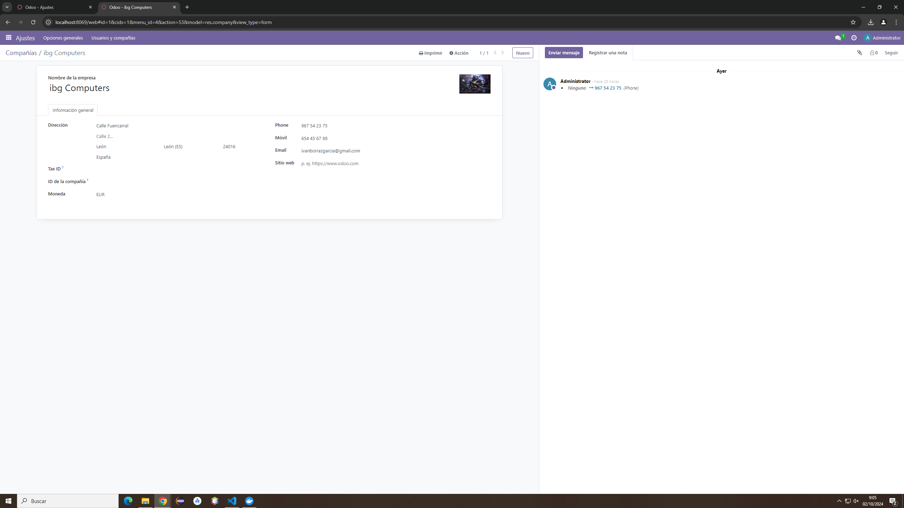
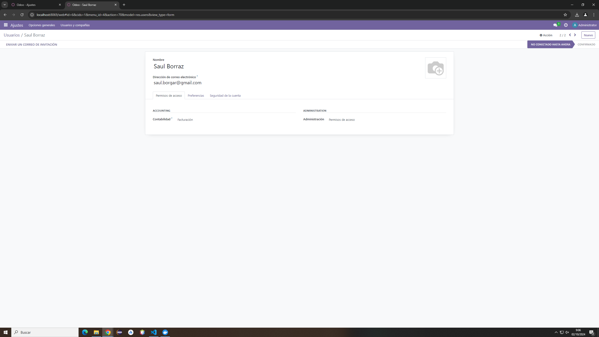
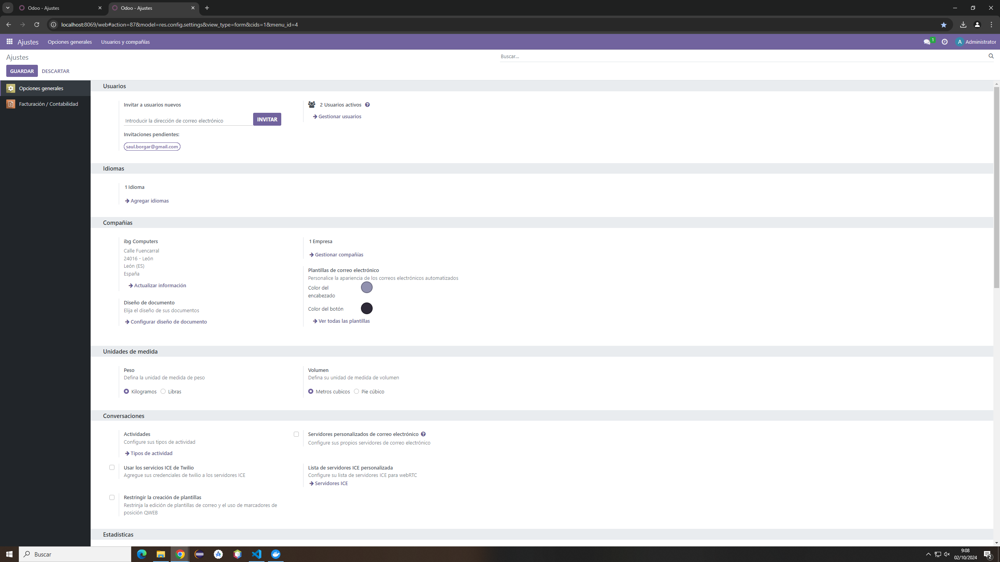
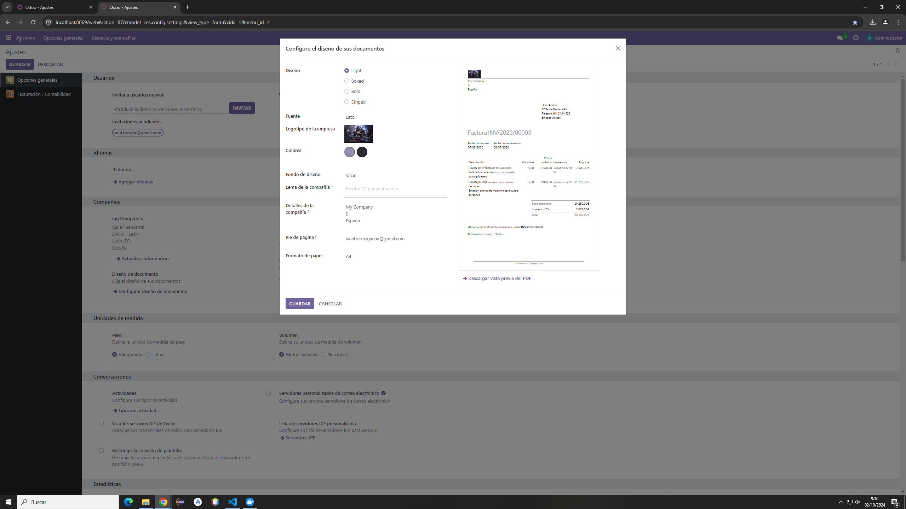
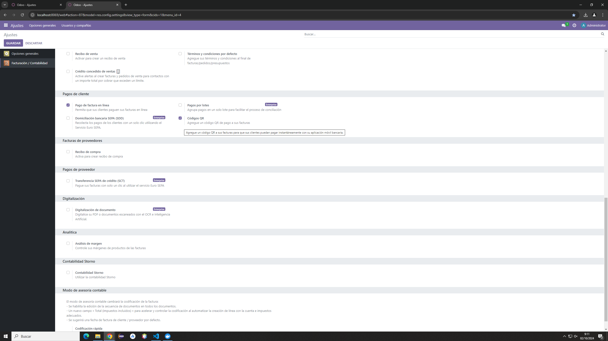
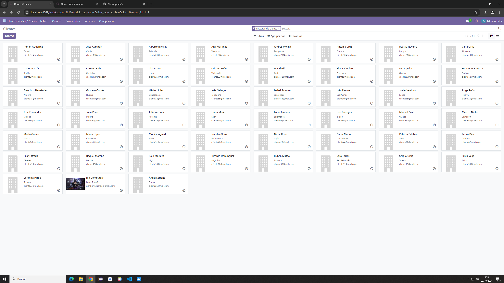

# Facturas con Odoo
### Pasos
1. Primero voy a ajustes, le doy donde pone "Usuarios y compañías" y selecciono compañías, le doy a "Nuevo" y introduzco los pongo los datos
   
2. En "Usuarios y compañias" selecciono usuarios y le doy a "Nuevo" y donde pone contabilidad seleciono "Facturación" y en administración selecciono "Permisos de acceso"
   
3. En "Ajustes", donde pone Compañía cambio los coleres de mi compañía
   
4. Pulsando en "Configurar diseño de documento" añado una imagen a mi compañía y en "Fondo de diseño" añadí geometría
   
5. En Facturación/Contabilidad voy hasta "Pagos de cliente" y activo Códiggos QR
   
6. En Clientes le doy a "importar registros" y subo un excel con datos de clientes
   
   [clientes.csv](./clientes.csv)
7. Cambio al usuario cerado anteriormente, voy a facturas y creo una nueva factura añadiendo un cliente y añadiendo los datos
   [Factura](./INV_2024_00001.pdf)