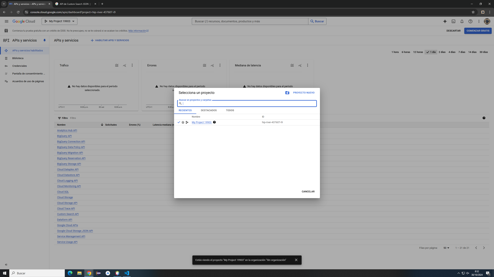
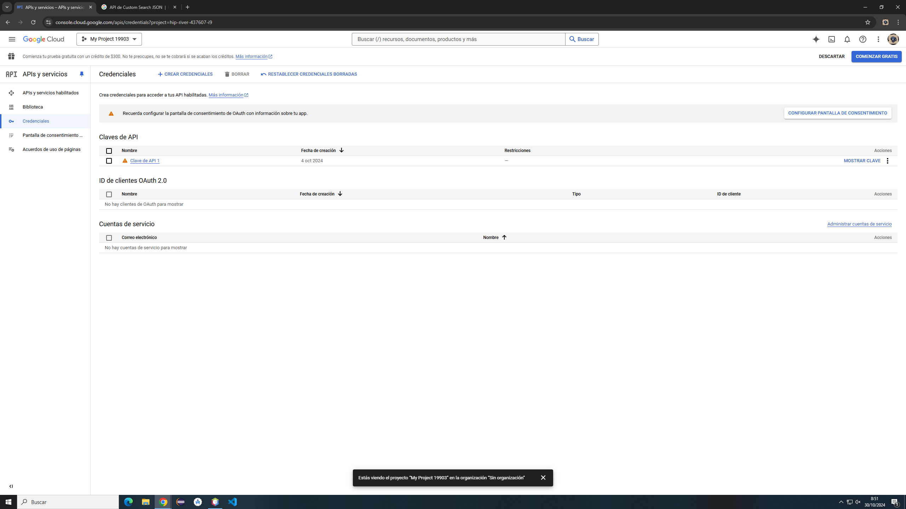
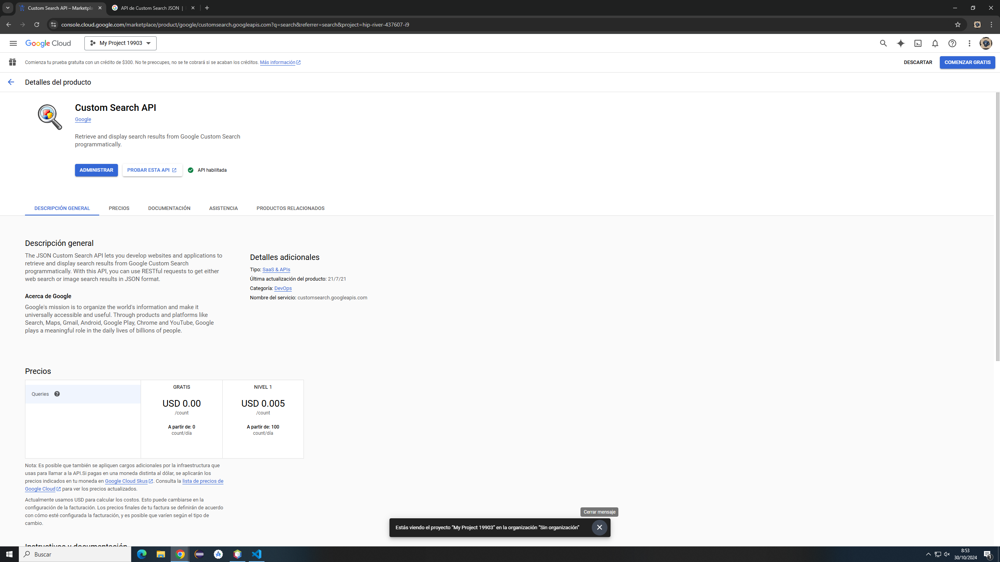
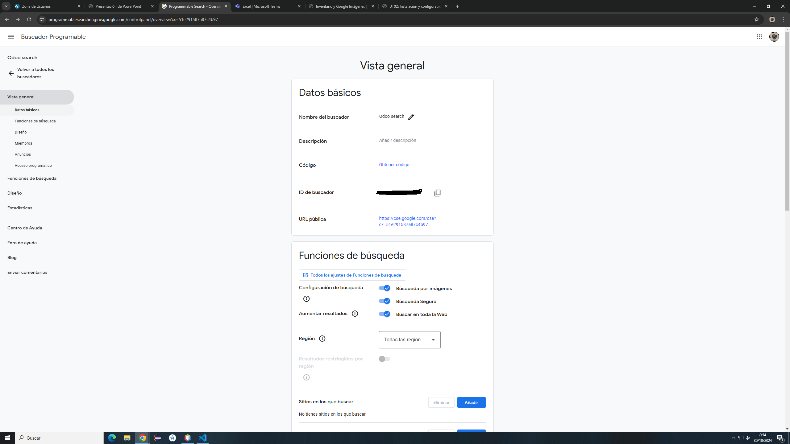

# Inventario y Google Imágenes

1. Voy a la página web de Google APIs y me regristo con google
2. Creo un nuevo proyecto
   
3. Voy al apartado de credenciales y le doy a crear credencial con una Clave de API
   
4. En la biblioteca busco Custom Search Api y lo habilito
   
5. Voy a Google Programmable Search Dashboard y creo un nuevo buscador
6. 
7. Voy a Odoo y en la parte de Ajustes activo Google Imágenes y escribo la Clave API que me dieron en el Google Apis y el ID de motor de búsqueda y escribo lo que me dió el Google Programmable Search Dashboard