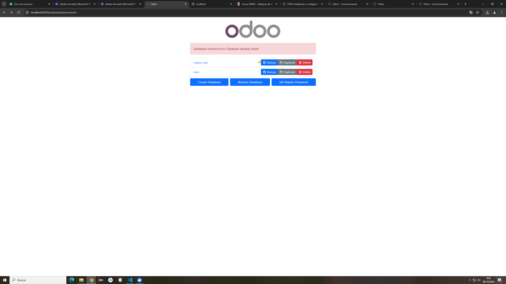

# Integración de servicios externos
## Parte 1
1. Uso el comando *docker-compose exec db bash*
2. Detenemos el servicio con *service postgresql stop*
3. Creamos una copia de seguridad en mi caso con el comando *pg_dump -U odoo ivan > backup.sql*
4. Salimos a la máquina física con *exit*
5. Sacamos la copia con docker cp backup.sql 2bfd:/
6. Borro los Contenedores de Docker y los directorios del dataPG
7. Levantamos con *docker compose up*
8. Restauro la copia con *createdb -U odoo -O odoo ivan* y *psql -U odoo ivan < backup.sql*

## Parte 2
1. Voy a la página [http://localhost:8069/web/database/manager](http://localhost:8069/web/database/manager) y le doy a Backup, pongo la contraseña y se descarga un filestore
   
2. Elimino los contenedores y el contenido de dataPG
3. Uso el *dorcker compose up*
4. le doy a *Restore Database* e introduzco los datos
    
    
5. base de datos restaurada

