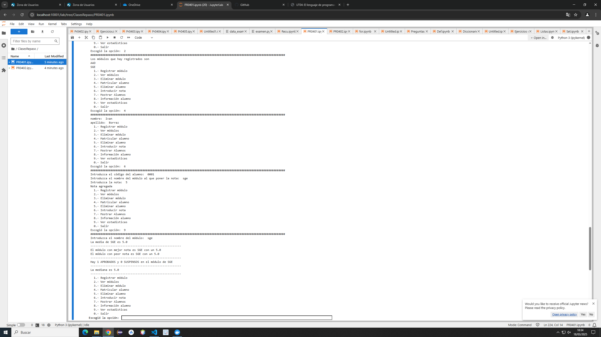

# Código del ejercicio
import os 

alumnos = [] 
alumno = {} 
modulo = {} 
modulos = set()
notas = {}

name="" 
apell="" 
numero="" 
ultimonum = [] 
numeros = {} 

def registrar_modulo(mod): 
    global modulos 
    mod = mod.upper()
    if (mod in modulos): 
        modulos.add(mod) 
    else: 
        model = {mod : 0} 
        modulo.update(model) 
        modulos.add(mod) 

def matricular_alumno(name, apell): 
    num="" 
    if (len(ultimonum)) == 0: 
        
        num = "0001"
        ultimonum.append(num)
         
    else:  
        n = int(ultimonum[-1]) 
        print(n) 
        n1 = str(n+1) 
        if (len(n1)==1): 
            num = '000'+n1 
        elif (len(n1)==2): 
            num = '00'+n1 
        elif (len(n1) == 3 ): 
            num = '0' + n1 
    alumno = {"nombre":name + " " + apell,  
              "codigo":num, 
              "modulos": {}} 
    ultimonum.append(num)
    alumnos.append(alumno) 

def verEstadisticas(mode):
    notaM= 0.0
    num=0
    notas= 0.0

    moduloMejorNota=""
    moduloPeorNota=""
    mejorNota = 0.0
    peorNota = 10.0

    aprobados = 0
    suspensos = 0

    mediana = 0
    listaMediana = []
    numMediana = 0
    for a in alumnos:
        for modulo, nota in a['modulos'].items():
            if (mode.upper() == modulo):
                notas += nota
                num = num+1
    notaM = notas/num
    print("La media de " + str(mode.upper()) + " es " + str(notaM))
    print("------------------------------------------------------")

    for a in alumnos:
        for modul, nota in a['modulos'].items():
            if (nota < peorNota):
                peorNota = nota
                moduloPeorNota=modul
            if (nota > mejorNota):
                mejorNota = nota
                moduloMejorNota = modul
    print("El módulo con mejor nota es " + moduloMejorNota + " con un " + str(mejorNota))
    print("El módulo con peor nota es " + moduloPeorNota + " con un " + str(peorNota))
    print("------------------------------------------------------")

    for a in alumnos:
        for modul, nota in a['modulos'].items():
            if (modul==mode.upper()):
                if nota >= 5:
                    aprobados += 1
                else:
                    suspensos +=1
    print("Hay " + str(aprobados) + " APROBADOS y " + str(suspensos) + " SUSPENSOS en el módulo de " + mode.upper())
    print("------------------------------------------------------")

    for a in alumnos:
        for modul, nota in a['modulos'].items():
            if (modul == mode.upper()):
                listaMediana.append(nota)
    listaMediana = sorted(listaMediana)
    numMediana = len(listaMediana)
    if (numMediana % 2 == 0):
        num1 = numMediana / 2
        num2 = num1 - 1

        mediana = (float(listaMediana[int(num1)]) + float(listaMediana[int(num2)])) /2
    else:
        nu = int(numMediana/2)
        mediana = float(listaMediana[nu])
    print("La mediana es " + str(mediana))
    print("------------------------------------------------------")

while True: 
    print("  1.- Registrar módulo") 
    print("  2.- Ver módulos") 
    print("  3.- Eliminar módulo") 
    print("  4.- Matricular alumno") 
    print("  5.- Eliminar alumno") 
    print("  6.- Introducir nota") 
    print("  7.- Mostrar Alumnos") 
    print("  8.- Información alumno") 
    print("  9.- Ver estadísticas") 
    print("  0.- Salir") 
    op = input("Escogió la opción: ") 

    match op: 
        case "1": 
            print("####################################################################################################################") 
            mod = input("Nombre del módulo:" ) 
            registrar_modulo(mod) 

        case "2": 
            print("####################################################################################################################")             
            print("Los módulos que hay registrados son") 
            for a in modulos: 
                print(a) 
             
        case "3": 
            print("####################################################################################################################") 
            m = input("Modulo que desea eliminar:").upper()
            if m in modulo:
                modulo.pop(m) 
            if (m in modulos): 
                modulos.remove(m)
                print("Módulo eliminado")
            else:
                print("El módulo no existe") 

        case "4": 
            print("####################################################################################################################") 
            name = input("nombre: ") 
            apell = input("apellido: ") 
            matricular_alumno(name,apell) 
            

        case "5": 

            print("####################################################################################################################") 
            code_elim = input("Introduzca el código de la persona que quiere eliminar: ") 
            for a in alumnos: 
                if a["codigo"] == code_elim: 
                    alumnos.remove(a) 
                    print("Alumno eliminado") 
            print(alumnos) 

        case "6": 
            print("####################################################################################################################") 
            while True:
                code = input("Introduzca el código del alumno: ") 
                mode = input("Introduzca el nombre del módulo al que poner la nota: ") 
                try:
                    note = float(input("Introduzca la nota: ")) 
                    break
                except ValueError:
                    print("Error: si introduce un número que sea con punto. Por ejemplo: 9.3")
                    print("")
            
            encontrado = False
            for a in alumnos:
                if a['codigo'] == code:
                    if mode.upper() in modulos:
                        a['modulos'][mode.upper()] = note
                        print("Nota agregada")
                        encontrado = True
                    else:
                        print("Módulo no encontrado")
                        encontrado = True
                    break
            if encontrado == False:
                print("No se encontró a ningún alumno con ese código")
        case "7": 
            print("####################################################################################################################") 
            for a in alumnos:
                print("Nombre:", a['nombre'])
                print("Código:", a['codigo'])
                print("Módulos:")

                for modulo, nota in a['modulos'].items():
                    print("  - "+str(modulo)+ ": " + str(nota))
                print("---------------------------")
        case "8": 
            print("####################################################################################################################") 
            code = input("Código de la persona de la que busca información: ")
            for a in alumnos:
                if a['codigo']== code:
                    print("Nombre: " + a['nombre'])
                    print("Módulos: ")
                    for modulo, nota in a['modulos'].items():
                        print("  - " + str(modulo) + ": " + str(nota))
        case "9": 
            print("####################################################################################################################") 
            m = input("Introduzca el nombre del módulo: ")
            verEstadisticas(m)

        case "0": 
            print("####################################################################################################################") 
            print("Saliendo del programa...") 
            break 

        case _: 
            print("####################################################################################################################") 
            print("Opción no válida, elija otra") 
