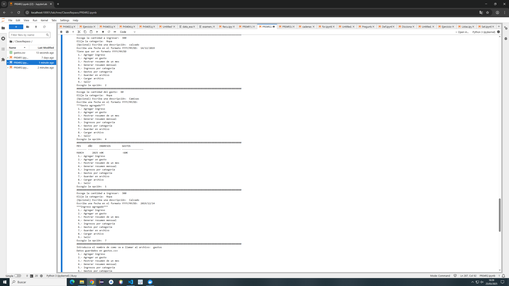

# Código del ejercicio
    import os
    import locale
    from datetime import date, datetime

    # Configurar el idioma a español

    ingresos = []
    gastos = []
    categorias = set()

    def agregar_ingreso(cantidad, categoria, descripcion, fecha):
        global categorias
        categoria = categoria.upper()
        
        categorias.add(categoria)
        if fecha:
            try:
                datetime.strptime(fecha, '%Y/%m/%d') #Convertir a date
            except:
                print("Tiene que ser en formato YYYY/MM/DD")
                return
        else: 
            hoy = date.today()
            fecha = hoy.strftime('%Y/%m/%d')
        ingreso = {
            "cantidad": cantidad,
            "categoria": categoria,
            "descripción": descripcion,
            "fecha" : fecha
        }
        ingresos.append(ingreso)
        print("***Ingreso agregado***")
    ##################################################################################################################################
    def agregar_gastos(cantidad, categoria, descripcion, fecha):
        global categorias
        categoria = categoria.upper()
        
        if fecha:
            try:
                datetime.strptime(fecha, '%Y/%m/%d') #Convertir a date
            except:
                print("Tiene que ser en formato YYYY/MM/DD")
                return
        else: 
            hoy = date.today()
            fecha = hoy.strftime('%Y/%m/%d')
        gasto = {
            "cantidad": cantidad,
            "categoria": categoria,
            "descripción": descripcion,
            "fecha" : fecha
        }
        gastos.append(gasto)
        print("***Gasto agregado***")
    ##################################################################################################################################
    def obtener_dia(fecha):
        return datetime.strptime(fecha, "%Y/%m/%d").day

    def obtener_mes(fecha):
        return datetime.strptime(fecha, "%Y/%m/%d").strftime("%B").upper()

    def obtener_año(fecha):
        return datetime.strptime(fecha, "%Y/%m/%d").year
    ##################################################################################################################################
    def mostrar_resumen_mes(mes, año):
        transacciones= []
        mes = mes.upper()
        for ingreso in ingresos:
            fe = ingreso["fecha"]

            if(mes == obtener_mes(fe) and int(año) == obtener_año(fe)):
                transacciones.append({
                    "dia": obtener_dia(ingreso["fecha"]),
                    "descripcion": ingreso["descripción"],
                    "ingreso": f"+{ingreso['cantidad']}€",
                    "gasto": ""
                })
        for gasto in gastos:
            fe = gasto["fecha"]
            
            if(mes == obtener_mes(fe) and int(año) == obtener_año(fe)):
                transacciones.append({
                    "dia": obtener_dia(gasto["fecha"]),
                    "descripcion": gasto["descripción"],
                    "ingreso": "",
                    "gasto": f"-{gasto['cantidad']}€"
                })
        total_ingresos = 0
        for ing in transacciones:
            if ing["ingreso"]:
                cantidad = ing["ingreso"].replace("+","").replace("€","")
                total_ingresos += int(cantidad)
        
        total_gastos = 0
        for gas in transacciones:
            if gas["gasto"]:
                cantidad = gas["gasto"].replace("-","").replace("€","")
                total_gastos += int(cantidad)

        print(f"MES: {mes}     AÑO: {año}")
        print()
        print(" Día   Descripción           Ingreso     Gasto")
        print("---- --------------------- ----------- ----------")
        for transaccion in transacciones:
            print(f"{transaccion['dia']:4} {transaccion['descripcion']:21} {transaccion['ingreso']:11} {transaccion['gasto']:10}")
            # Se podría usar <4 o >4 para alinearlo a la izquierda o a la derecha
        print("---- --------------------- ----------- ----------")
        print(f"{'':4} {'TOTAL':21} {f'+{total_ingresos}€':11} {f'-{total_gastos}€':10}")
    ##################################################################################################################################
    def mostrar_resumen_mensual():
        resumen = {}
        for ingreso in ingresos:
            mesI = obtener_mes(ingreso["fecha"])
            añoI = obtener_año(ingreso["fecha"])
            #Crear una tupla con los datos de mes y año
            clave = (mesI, añoI)
            if clave not in resumen:
                
                resumen[clave]= {"ingresos": 0, "gastos": 0}
            
            resumen[clave]["ingresos"] += ingreso["cantidad"]
            
            
        for gasto in gastos:
            mesG = obtener_mes(gasto["fecha"])
            añoG = obtener_año(gasto["fecha"])
            clave = (mesG,añoG)
            
            if clave not in resumen:
                resumen[clave]= {"ingresos": 0, "gastos": 0}
            resumen[clave]["gastos"] += gasto["cantidad"]
        print("MES     AÑO     INGRESOS        GASTOS")
        print("------- ------- --------------- ---------------")
        for (mes,año), cantidad in resumen.items():
            ing = cantidad["ingresos"]
            gas = cantidad["gastos"]
            print(f"{mes:7} {año:7} {f'+{ing}€':15} {f'-{gas}€':15}")
    ##################################################################################################################################
    def ingresos_categoria(categoria):
        total = 0
        resultados = []
        for ingreso in ingresos:
            if (categoria.upper() == ingreso["categoria"].upper()):
                resultados.append({
                    "descripcion": ingreso["descripción"],
                    "ingreso" : ingreso["cantidad"]
                })
                
        print("Descripción            Ingreso")
        print("--------------------- -----------")
        for resultado in resultados:
            print(f"{resultado['descripcion']:21}{resultado['ingreso']:11}")
            total += resultado["ingreso"]
        print("--------------------- -----------")
        print(f"El total de ingresos es {total}")
    ##################################################################################################################################   
    def gastos_categoria(categoria):
        total = 0
        resultados = []
        for gasto in gastos:
            if (categoria.upper() == gasto["categoria"].upper()):
                resultados.append({
                    "descripcion": gasto["descripción"],
                    "gasto" : gasto["cantidad"]
                })
                
        print("Descripción            Gasto")
        print("--------------------- -----------")
        for resultado in resultados:
            print(f"{resultado['descripcion']:21}{resultado['gasto']:11}")
            total += resultado["gasto"]
        print("--------------------- -----------")
        print(f"El total de gastos es {total}")
    ##################################################################################################################################
    def guardar_en_csv(nombre):
        nombre = nombre.strip()
        i = len(nombre)
        punto = nombre[i-4]
        if (not punto == "."):
            nombre = nombre +".csv"
        with open(nombre, "w") as fichero:
            fichero.write("ingreso/gasto, cantidad, categoria, descripcion, fecha\n")
            for ing in ingresos:
                fichero.write(f'ingreso,{ing["cantidad"]},{ing["categoria"]},{ing["descripción"]},{ing["fecha"]}\n')
            for gas in gastos:
                fichero.write(f'gasto,{gas["cantidad"]},{gas["categoria"]},{gas["descripción"]},{gas["fecha"]}\n')
        print(f"Datos guardados en {nombre}")
    ##################################################################################################################################
    def cargar_csv(nombre):
        global ingresos
        global gastos

        try:
            with open(nombre, "r") as fichero:
                contenido = fichero.read().split("\n")

                ingresos.clear()
                gastos.clear()

                for linea in contenido[1:]:
                    partes = linea.strip().split(",")
                    if len(partes) < 4: 
                        continue

                    tipo = partes[0]
                    cantidad = partes[1]

                    try:
                        cantidad = int(cantidad) 
                    except ValueError:
                        print(f"Error: Cantidad no válida en la línea -> {linea}")
                        continue

                    categoria = partes[2]
                    
                    if len(partes) == 5:
                        descripcion = partes[3]
                        fecha = partes[4].strip()
                    else:
                        descripcion = ""
                        fecha = partes[3].strip()
                    
                    if tipo == "ingreso":
                        ingreso = {"cantidad": cantidad, "categoria": categoria, "descripción": descripcion, "fecha" : fecha}
                        ingresos.append(ingreso)
                    elif tipo == "gasto":
                        gasto = {"cantidad": cantidad, "categoria": categoria, "descripción": descripcion, "fecha" : fecha}
                        gastos.append(gastos)
            print(f"Datos cargados con exito de {nombre}")
        except FileNotFoundError:
            print(f"Error: Fichero {nombre} no encontrado")
    while True:
        print(" 1.- Agregar ingreso")
        print(" 2.- Agregar un gasto")
        print(" 3.- Mostrar resumen de un mes")
        print(" 4.- Generar resumen mensual")
        print(" 5.- Ingresos por categoria")
        print(" 6.- Gastos por categoría")
        print(" 7.- Guardar en archivo")
        print(" 8.- Cargar archivo")
        print(" 9.- Salir")
        op = input("Escogio la opción: ")

        match op:
            case "1":
                print("####################################################################################################################") 
                try:
                    cantidad = int(input("Escoga la cantidad a ingresar: "))
                    categoria = input("Elija la categoría: ")
                    descripcion= input("(Opcional) Escriba una descripción: ")
                    fecha = input("Escriba una fecha en el formato YYYY/MM/DD: ")
                    agregar_ingreso(cantidad, categoria, descripcion, fecha)
                    # print(ingresos)
                except:
                    print("Ha ocurrido un error")
                
            case "2":
                print("####################################################################################################################") 
                try:
                    cantidad = int(input("Escoga la cantidad del gasto: "))
                    categoria = input("Elija la categoría: ")
                    descripcion= input("(Opcional) Escriba una descripción: ")
                    fecha = input("Escriba una fecha en el formato YYYY/MM/DD: ")
                    agregar_gastos(cantidad, categoria, descripcion, fecha)
                    # print(gastos)
                except:
                    print("Ha ocurrido un error")
            case "3":
                print("####################################################################################################################") 
                
                mes = input("Introduzca el mes que busca: ")
                año = input("Introduzca el año que busca: ")
                mostrar_resumen_mes(mes, año)
            case "4":
                print("####################################################################################################################") 
                mostrar_resumen_mensual()
                
            case "5":
                print("####################################################################################################################") 
                categoria = input("Introduzca la categoría de la que quiere buscar los ingresos: ")
                ingresos_categoria(categoria)
            case "6":
                print("####################################################################################################################") 
                categoria = input("Introduzca la categoría de la que quiere buscar los gastos: ")
                gastos_categoria(categoria)
            case "7":
                print("####################################################################################################################") 
                nombre = input("Introduzca el nombre de como va a llamar al archivo: ")
                guardar_en_csv(nombre)
            case "8":
                print("####################################################################################################################") 
                nombre = input("Introduzca el nombre del archivo que quiere cargar: ")
                cargar_csv(nombre)
            case "9":
                print("####################################################################################################################") 
                print("Saliendo del programa...")
                break
            case _:
                print("####################################################################################################################") 
                print("Opción no válida, elija otra opción")
