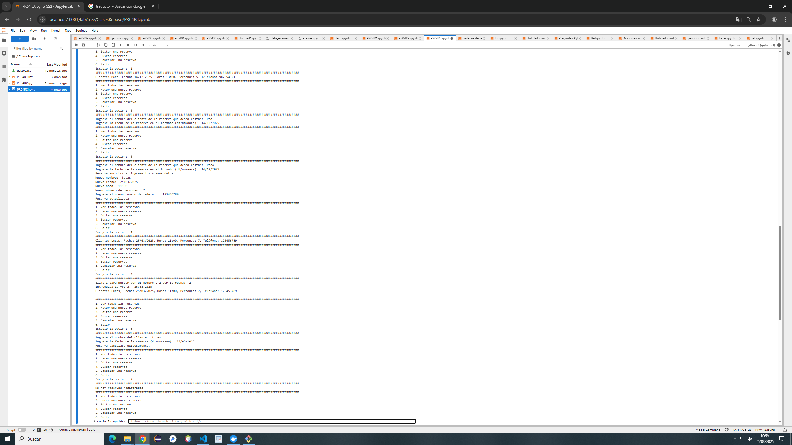

# Código del ejercicio
    import os
    import datetime
    reservas = []

    def ver_reservas():
        if not reservas:
            print("No hay reservas registradas.")
        else:
            for r in reservas:
                print(f"Cliente: {r['nombre']}, Fecha: {r['fecha']}, Hora: {r['hora']}, Personas: {r['personas']}, Teléfono: {r['telefono']}")
    ####################################################################################################################################################
    def validar_fecha(fecha, hora):
        try:
            fechaR = datetime.datetime.strptime(fecha, "%d/%m/%Y").date()
            horaR = datetime.datetime.strptime(hora, "%H:%M").time()
            ahora = datetime.datetime.now()
            if datetime.datetime.combine(fechaR, horaR) > ahora:
                return True
            else:
                print("La reserva debe ser para más tarde")
                return False
        except ValueError:
            print("Formato inválido")
            return False
        
    def nueva_reserva():
        nombre = input("Nombre del cliente: ")
        fecha = input("Fecha de la reserva (dd/mm/aaaa): ")
        hora = input("Hora de la reserva (hh:mm): ")
        personas = int(input("Número de personas: "))
        telefono = input("Número de teléfono: ")       
        
        
        if (personas <= 0):
            print("El número de personas debe ser mayor que 0")
        if validar_fecha(fecha,hora):
            reservas.append({"nombre": nombre, "fecha": fecha, "hora": hora, "personas": int(personas), "telefono": telefono})
            print("Reserva agregada exitosamente.")
    ####################################################################################################################################################
    def editar_reserva():
        nombre = input("Ingrese el nombre del cliente de la reserva que desea editar: ")
        fecha = input("Ingrese la fecha de la reserva en el formato (dd/mm/aaaa): ")
        for r in reservas:
            if r["nombre"].lower() == nombre.lower() and r["fecha"] == fecha:
                print("Reserva encontrada. Ingrese los nuevos datos.")
                nom = input("Nuevo nombre: ")
                
                nueva_fecha = input("Nueva fecha: ")
                nueva_hora = input("Nueva hora: ")
                nuevas_personas = int(input("Nuevo número de personas: "))
                if nuevas_personas <= 0:
                    print("El número de personas debe ser mayor a 0")
                    return
                if validar_fecha(nueva_fecha, nueva_hora):
                    r["nombre"] = nom
                    r["fecha"] = nueva_fecha
                    r["hora"] = nueva_hora
                    r["personas"] = nuevas_personas
                    print("Reserva actualizada")
                return
                
    ####################################################################################################################################################
    def buscar_reserva():
        resultado = []
        eleccion = int(input("Elija 1 para buscar por el nombre y 2 por la fecha: "))
        if eleccion == 1:
            nombre= input("Introduzca el nombre: ")
            for r in reservas:
                if (nombre.lower() in r["nombre"].lower()):
                    resultado.append(r)
        elif eleccion == 2:
            fecha = input("Introduzca la fecha: ")
            for r in reservas:
                if (r["fecha"] == fecha):
                    resultado.append(r)
        else:
            print("Opción no válida")
            return
        if resultado:
            for r in resultado:
                print(f"Cliente: {r['nombre']}, Fecha: {r['fecha']}, Hora: {r['hora']}, Personas: {r['personas']}, Teléfono: {r['telefono']}\n")
        else:
            print("No se encontraron reservas.")
    ####################################################################################################################################################
    def cancelar_reserva():
        nombre = input("Ingrese el nombre del cliente: ")
        fecha = input("Ingrese la fecha de la reserva (dd/mm/aaaa): ")
        for r in reservas:
            if r["nombre"].lower() == nombre.lower() and r["fecha"] == fecha:
                reservas.remove(r)
                print("Reserva cancelada exitosamente.")
                return
        print("Error: No se encontró la reserva.")
        
    while True:
        print("1. Ver todas las reservas")
        print("2. Hacer una nueva reserva")
        print("3. Editar una reserva")
        print("4. Buscar reservas")
        print("5. Cancelar una reserva")
        print("6. Salir")
        op = input("Escogio la opción: ")

        match op:
            case "1":
                print("###################################################################################################################") 
                ver_reservas()
                print("###################################################################################################################") 
            case "2":
                print("###################################################################################################################") 
                nueva_reserva()
                print("###################################################################################################################") 
            case "3":
                print("###################################################################################################################") 
                editar_reserva()
                print("###################################################################################################################") 
            case "4":
                print("###################################################################################################################") 
                buscar_reserva()
                print("###################################################################################################################") 
            case "5":
                print("###################################################################################################################") 
                cancelar_reserva()
                print("###################################################################################################################") 
            case "6":
                print("###################################################################################################################") 
                print("Saliendo del programa...")
                break
            
            case _:
                print("###################################################################################################################") 
                print("Opción no válida, elija otra opción")

