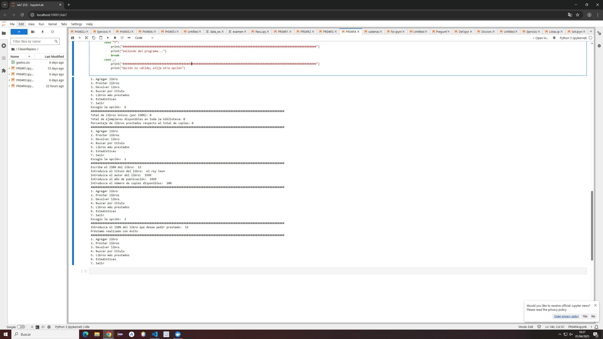

# Código del ejercicio
    import os

    biblioteca = {}
    ISBN_libros = []

    def agregar_libro():
        isbn = input("Escriba el ISBN del libro: ")
        if isbn not in ISBN_libros:
            titulo = input("Introduzca el título del libro: ")
            autor = input("Introduzca el autor del libro: ")
            año_pub = int(input("Introduzca el año de publicación: "))
            copias_dis = int(input("Introduzca el número de copias disponibles: "))
            prestados = 0
            ISBN_libros.append(isbn)
            libro = { isbn : {
            "titulo": titulo,
            "autor": autor,
            "año_publicacion": año_pub,
            "copias_disponibles": copias_dis,
            "prestados": prestados
            }}
            biblioteca.update(libro)
    ####################################################################################################################################################
    def prestar_libro(isbn):
        if isbn in biblioteca:
            libro = biblioteca[isbn]
            if libro["copias_disponibles"] >= 1:
                copias = libro["copias_disponibles"]
                copias -= 1
                    
                prestamo = libro["prestados"]
                prestamo += 1
                    
                libro["copias_disponibles"] = copias
                libro["prestados"] = prestamo
                print("Préstamo realizado con éxito")
            else:
                print("No quedan copias")
        else:
            print("No se ha encontrado ningún libro con ese ISBN")
    ####################################################################################################################################################
    def devolver_libro(isbn):
        if isbn in biblioteca:
            libro = biblioteca[isbn]
            copias = libro["copias_disponibles"]
            copias += 1
            libro["copias_disponibles"] = copias
            print("Devolución realizada con éxito")
        else:
            print("No se ha encontrado ningún libro con ese ISBN")
    ####################################################################################################################################################
    def buscar_por_titulo(titulo):
        encontrados = []
        for isbn,libro in biblioteca.items():
            if titulo.lower() in libro["titulo"].lower():
                encontrados.append((isbn,libro))
        if encontrados:
            for isbn,libro in encontrados:
                print(f"ISBN: {isbn}, Título: {libro['titulo']}, Autor: {libro['autor']}, Año publicado: {libro['año_publicacion']}, Copias: {libro['copias_disponibles']}, Veces prestado: {libro['prestados']}")
        else:
            print("No hay libros con ese título")
    ####################################################################################################################################################
    def libros_mas_prestados():
        libros = list(biblioteca.values())

        for i in range (len(libros)):
            for j in range(i + 1, len(libros)):
                if libros[i]['prestados'] < libros[j]['prestados']:
                    a = libros[i]
                    libros[i] = libros[j]
                    libros[j] = a
        primeros = libros[:3]
        for libro in primeros:
            print(f"Título: {libro['titulo']}, Veces prestado: {libro['prestados']}")
    ####################################################################################################################################################
    def estadisticas():
        libros_unicos = len(biblioteca)
        copias_disponibles = 0
        total_prestados = 0
        
        for libro in biblioteca.values():
            copias_disponibles += libro["copias_disponibles"]
            total_prestados += libro["prestados"]
        total_copias = copias_disponibles + total_prestados
        if total_copias > 0:
            porcentaje = (total_prestados/copias_disponibles) * 100
        else:
            porcentaje = 0

        print(f"Total de libros únicos (por ISBN): {libros_unicos}")
        print(f"Total de ejemplares disponibles en toda la biblioteca: {copias_disponibles}")
        print(f"Porcentaje de libros prestados respecto al total de copias: {porcentaje}")
        
    while True:
        print("1. Agregar libro")
        print("2. Prestar libros")
        print("3. Devolver libro")
        print("4. Buscar por titulo")
        print("5. Libros más prestados")
        print("6. Estadísticas")
        print("7. Salir")
        op = input("Escogio la opción: ")

        match op:
            case "1":
                print("###################################################################################################################") 
                agregar_libro()
                
                print("###################################################################################################################") 
            case "2":
                print("###################################################################################################################") 
                isbn_pedir = input("Introduzca el ISBN del libro que desea pedir prestado: ")
                prestar_libro(isbn_pedir)
                
                print("###################################################################################################################") 
            case "3":
                print("###################################################################################################################") 
                isbn_devolver = input("Introduzca el ISBN del libro que desea devolver: ")
                devolver_libro(isbn_devolver)
                
                print("###################################################################################################################") 
            case "4":
                print("###################################################################################################################") 
                titulo = input("Introduzca el título que busca: ")
                buscar_por_titulo(titulo)
                print("###################################################################################################################") 
            case "5":
                print("###################################################################################################################") 
                libros_mas_prestados()
                print("###################################################################################################################") 
            case "6":
                print("###################################################################################################################") 
                estadisticas()
                print("###################################################################################################################") 
            case "7":
                print("###################################################################################################################") 
                print("Saliendo del programa...")
                break
            case _:
                print("###################################################################################################################") 
                print("Opción no válida, elija otra opción")
            
