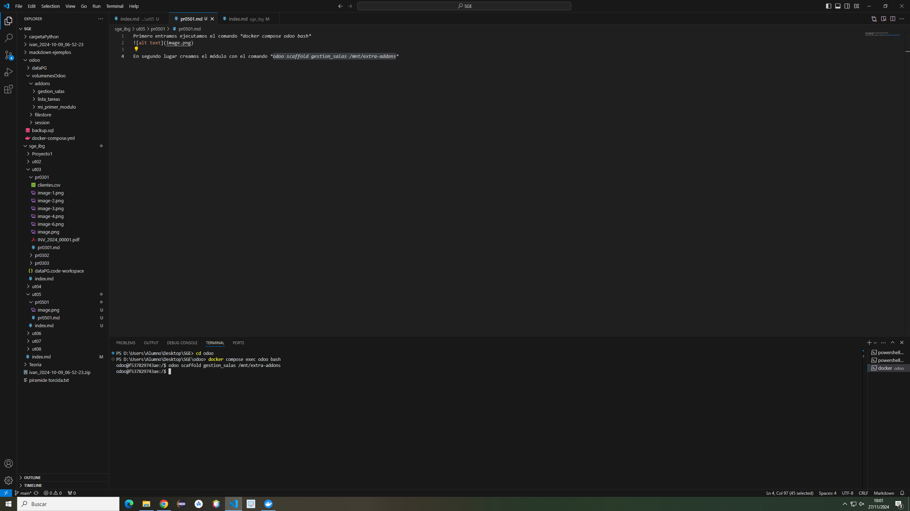
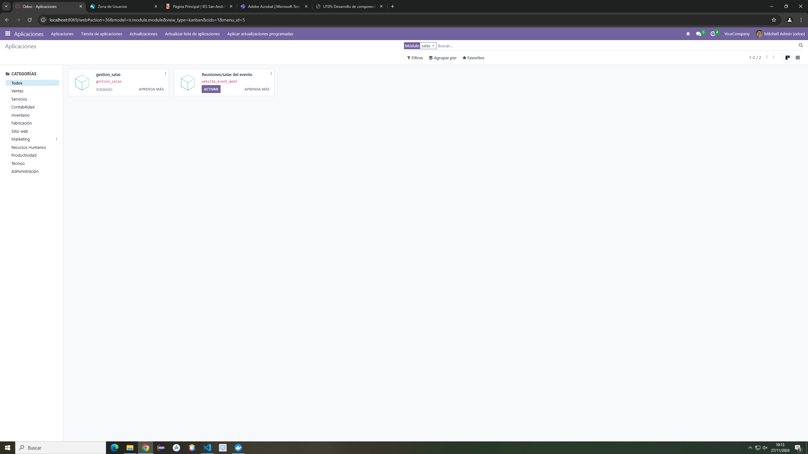

Primero entramos ejecutamos el comando *docker compose odoo bash*

En segundo lugar creamos el módulo con el comando *odoo scaffold gestion_salas /mnt/extra-addons*

Se habrá creado una carpeta llamada gestion_salas en la carpeta de addons 

Entramos en ella y vamos al directorio models, modificamos models.py para que quede con los datos que queremos

Para mostrar los datos vamos al directorio views y entramos en views.xml y lo modificamos para que se puedan ver los elementos que queremos mostrar

En odoo pulsamos *Actualizar lista de aplicaciones* y buscamos salas y aparecerá nuestro módulo
