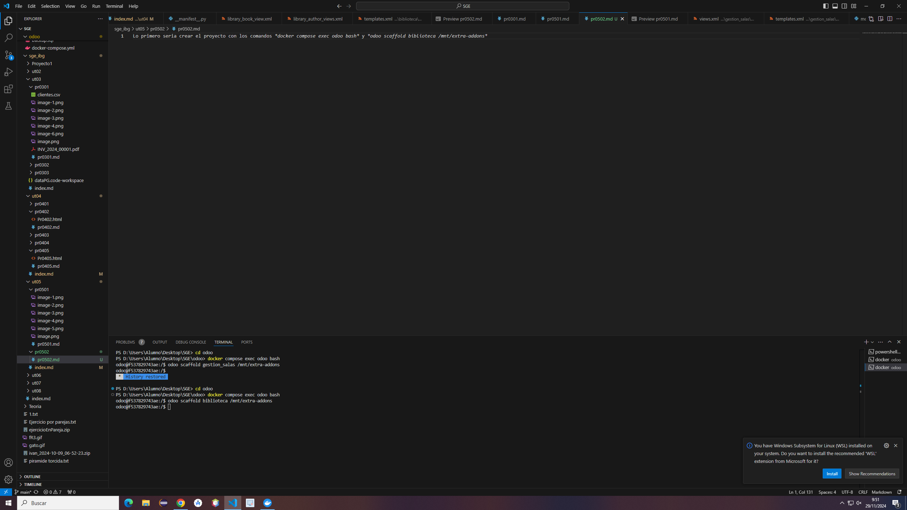
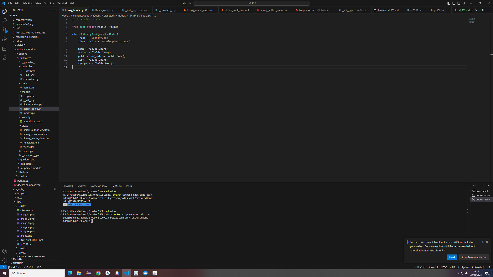
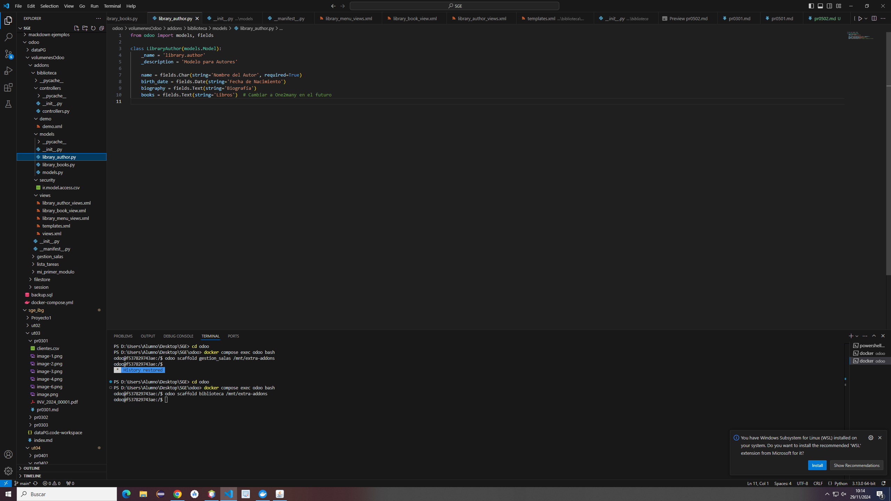
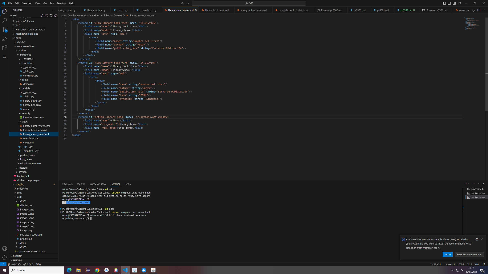
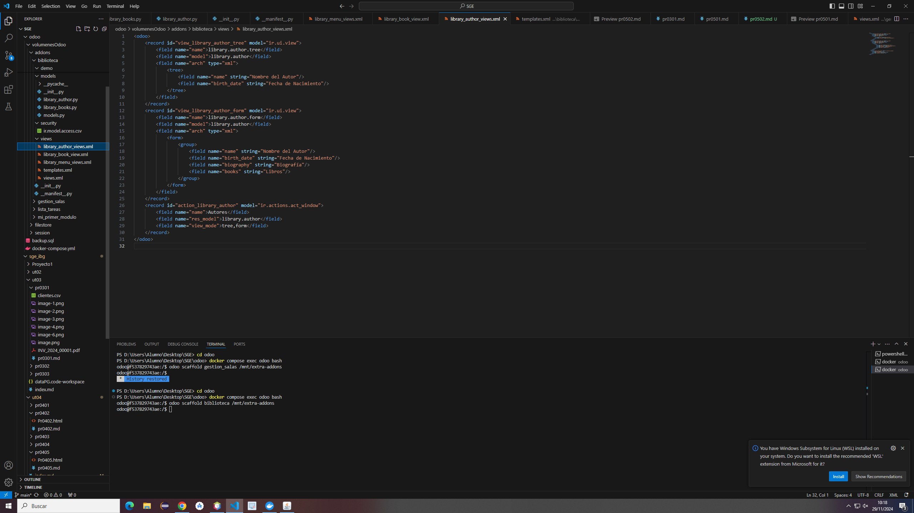
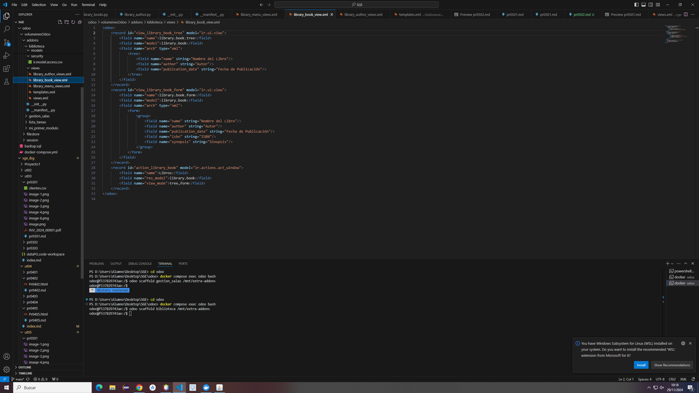
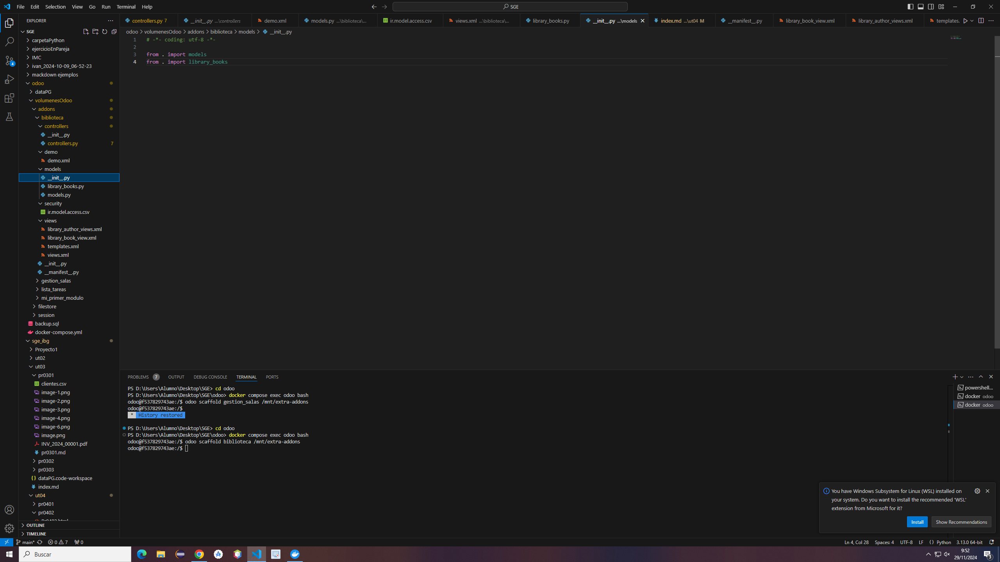

Lo primero seria crear el proyecto con los comandos *docker compose exec odoo bash* y *odoo scaffold biblioteca /mnt/extra-addons*

Creamos en models un *library_books.py* y un *library_authors.py* y lo rellenamos con los campos que sean necesarios

Creamos en views un *library_menu_views.xml*, un *library_author_view.xml* y un *library_book_view.xml*

Entramos en __init__.py de models y añadimos un import al otro módulo que creamos
