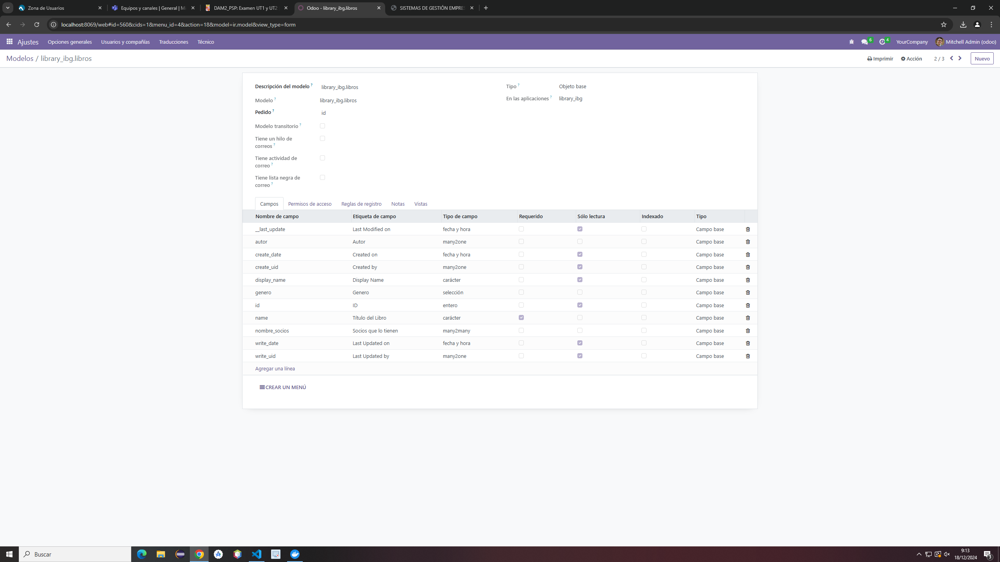
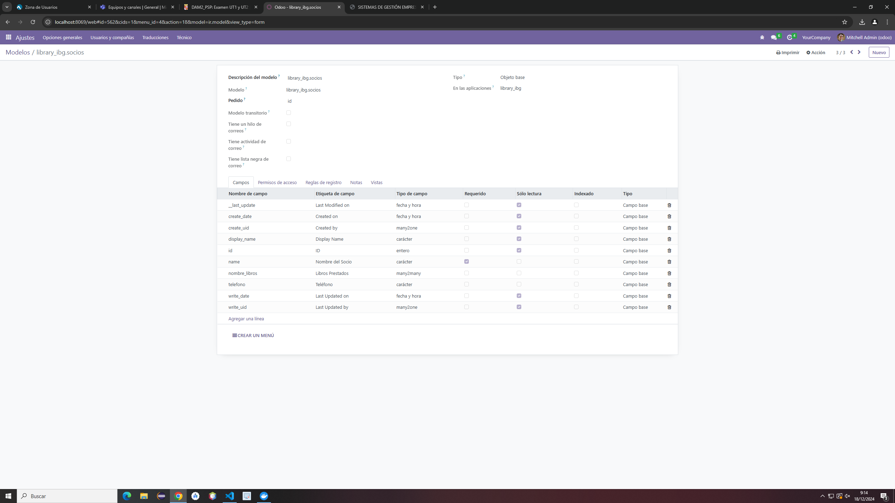

# Modelos
## Libros
    from odoo import models, fields

    class LibreriaLibros(models.Model):
        _name = 'library_ibg.libros'
        _description = 'library_ibg.libros'

        name = fields.Char(string='Título del Libro', required=True)
        autor_id = fields.Many2one('library_ibg.autores', string='Autor')
        genero = fields.Selection([
            ('novela', 'novela'),
            ('drama', 'drama'),
            ('ficcion', 'ciencia ficcion'),
            ('misterio', 'misterio'),
            ('terror', 'terror'),
            ('historico', 'histórico')
        ], string='Genero')
        nombre_socios = fields.Many2many('library_ibg.socios', string='Socios que lo tienen')

## Autores
    from odoo import models, fields

    class LibreriaAutores(models.Model):
        _name = 'library_ibg.autores'
        _description = 'library_ibg.autores'

        name = fields.Char(string='Nombre del Autor', required=True)
        pais = fields.Many2one('res.country', string='País de origen')
        nombre_libros = fields.One2many('library_ibg.libros', 'autor_id', string='Libros del Autor')

## Socios
    from odoo import models, fields

    class LibreriaSocios(models.Model):
        _name = 'library_ibg.socios'
        _description = 'library_ibg.socios'

        name = fields.Char(string='Nombre del Socio', required=True)
        telefono = fields.Char(string='Teléfono')
        nombre_libros = fields.Many2many('library_ibg.libros', string='Libros Prestados')
