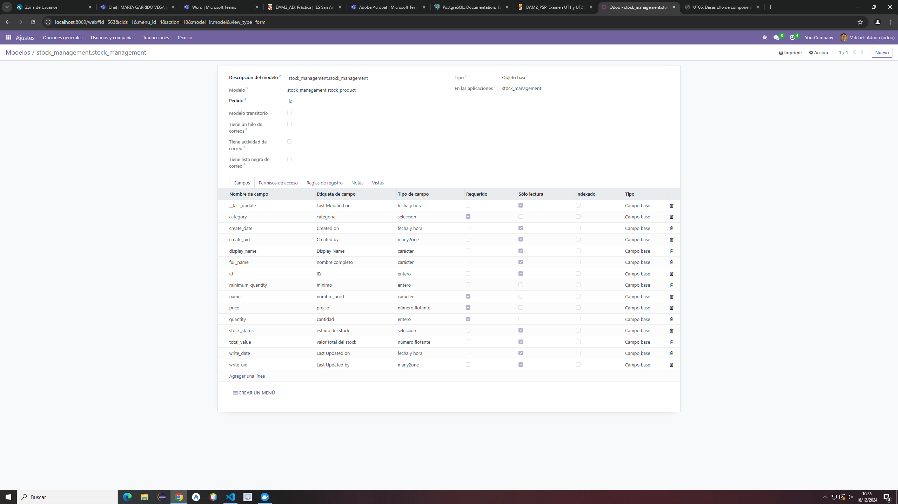

# Modelo del stock_managements

    from odoo import models, fields, api
    from odoo.exceptions import ValidationError

    class stock_management(models.Model):
        _name = 'stock_management.stock_product'
        _description = 'stock_management.stock_management'

        name = fields.Char(string='nombre_prod', required=True)
        category = fields.Selection (
            string="categoria",
            selection=[
                ("refrescos","Refrescos"),
                ("lacteos", "Lacteos"),
                ("embutidos", "Embutidos"),
                ("vegetales", "Vegetales"),
                ("snaks", "Snaks")
            ], 
            required=True
        )
        price = fields.Float(string='precio', required=True)
        quantity = fields.Integer(string='cantidad', required=True)
        total_value = fields.Float(string='valor total del stock', 
            compute='_stock_total', #Un compute
            store=True
        )
        minimum_quantity = fields.Integer(string='minimo')
        stock_status= fields.Selection(
            string='estado del stock', 
            selection=
            [
                ('normal', 'Normal'),
                ('low stock', 'Low Stock')
            ],
            compute='_stock_status', #Un compute
            store=True
        )
        full_name = fields.Char(string='nombre completo', 
            compute='_stock_full_name', #Un compute
            store=True
        )

        _sql_constraints = [
            ('nombre_unico', 'unique(name)','El nombre debe ser unico'),
            ('ver_cantidad', 'CHECK(quantity>=0)', 'La cantidad debe ser superior a 0')
        ]

        @api.depends('price','quantity')
        def _stock_total(self):
            for record in self:
                record.total_value = record.price * record.quantity
        
        @api.depends('quantity', 'minimum_quantity')
        def _stock_status(self):
            for record in self:
                if record.quantity >= record.minimum_quantity:
                    record.stock_status = 'normal'
                else:
                    record.stock_status = 'low stock'
        
        @api.depends('name','category')
        def _stock_full_name(self):
            for record in self:
                category_name = dict(self._fields['category'].selection).get(record.category, '')
                record.full_name = f"{record.name} ({category_name})"
        
        @api.constrains('quantity')
        def _comprobar_cantidad_stock(self):
            for record in self:
                if record.total_value > 100000:
                    raise ValidationError('El total_value no puede ser superior a 100000')

