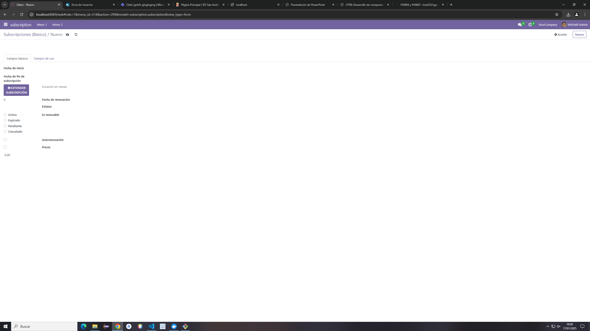

# Modelo de la Subsctiption

from odoo import models, fields, api
from datetime import timedelta
from dateutil.relativedelta import relativedelta

class subscription(models.Model):
    _name = 'subscription.subscription'
    _description = 'subscription.subscription'

    name = fields.Char(string='Nombre')

    customer_id = fields.Many2one('res.partner', string='Id del cliente')
    subscription_code = fields.Char(string='Código de subscripción')
    start_date = fields.Date(string='Fecha de inicio')
    end_date = fields.Date(string='Fecha de fin de subscripción')
    duration_months = fields.Integer(string='Duración en meses', compute="_duracion_meses")  
    renewal_date = fields.Date(string='Fecha de renovación')
    status = fields.Selection([
        ('active', 'Activo'),
        ('expired', 'Expirado'),
        ('pending','Pendiente'),
        ('cancelled','Cancelado')
    ],string='Estatus')
    is_renewable = fields.Boolean(string='Es renovable')
    auto_renewal = fields.Boolean(string='Autorenovación')
    price = fields.Float(string='Precio')

    usage_limit = fields.Integer(string='Límite de uso')
    percent_usage_limit = fields.Float(compute="_percent_usage_lim", store=True)
    current_usage = fields.Integer(string='Veces usado')
    use_percent = fields.Float(string='Porcentaje de uso', compute="_percent_usage_lim")

    # No funciona con duration_months asi que buscar otra forma de hacerlo
    @api.depends('start_date','end_date')
    def _duracion_meses(self):
        for a in self:
            if a.start_date and a.end_date:
                diff = relativedelta(a.end_date, a.start_date)
                years = diff.years if diff.years is not None else 0 # Diferencia de años si esta no es nula
                months = diff.months if diff.months is not None else 0 # Diferencia de memes si esta no es nula
                a.duration_months = years * 12 + months
            else:
                a.duration_months = 0
    
    @api.depends('usage_limit','current_usage')
    def _percent_usage_lim(self):
        for a in self:
            if a.usage_limit>0 and a.current_usage <= a.usage_limit:
                a.percent_usage_limit=(float(a.current_usage)/float(a.usage_limit))*100
                a.use_percent=(1-(float(a.current_usage) / float(a.usage_limit)))*100
            else:
                a.percent_usage_limit=0
                a.use_percent=100
    
    def extender_subscripcion(self):
        for a in self:
            if a.end_date:
                a.end_date += timedelta(15)
                
# Vista de subscription
<odoo>
  <data>
    <!-- explicit list view definition -->
    <!-- Modo de vista básico -->
    <record model="ir.ui.view" id="view_subscription_tree_basic">
      <field name="name">subscription list</field>
      <field name="model">subscription.subscription</field>
      <field name="arch" type="xml">
        <tree decoration-danger="status=='expired'"
          decoration-warning="status=='cancelled'"
          limit="15">
          <field name="name" />
          <field name="customer_id" />
          <field name="subscription_code" />
          <field name="start_date" />
          <field name="end_date" widget="remaining_days"/>
          <button name="extender_subscripcion" type="object" string="Extender subscripción" class="btn-primary" icon="fa-gift" />
          
          <field name="duration_months" />
          <field name="renewal_date" />
          <field name="status" 
          widget="radio"
          />
          <field name="is_renewable" />
          <field name="auto_renewal" />
          <field name="price" 
          attrs="{'invisible': [('status','=','cancelled')]}"/>
          <field name="percent_usage_limit" 
          widget="progressbar"
          string="Porcentaje uso"
          decoration-danger="percent_usage_limit >= 80.00"/>
          <field name="current_usage" 
          avg="1"/>
          <field name="use_percent" />
          
        </tree>
      </field>
    </record>
    <!-- Modo de vista de uso -->
    <record model="ir.ui.view" id="view_subscription_tree_usage">
      <field name="name">subscription list</field>
      <field name="model">subscription.subscription</field>
      <field name="arch" type="xml">
        <tree decoration-danger="status=='expired'"
          decoration-warning="status=='cancelled'"
          limit="15">
          <field name="name" />
          <field name="customer_id" />
          <field name="subscription_code" />
          <field name="start_date" />
          <field name="end_date" widget="remaining_days"/>
          <button name="extender_subscripcion" type="object" string="Extender subscripción" class="btn-primary" icon="fa-gift" />
          
          <field name="duration_months" />
          <field name="renewal_date" />
          <field name="status" 
          widget="radio"
          />
          <field name="is_renewable" />
          <field name="auto_renewal" />
          <field name="price" 
          attrs="{'invisible': [('status','=','cancelled')]}"/>
          <field name="percent_usage_limit" 
          widget="progressbar"
          string="Porcentaje uso"
          decoration-danger="percent_usage_limit >= 80.00"/>
          <field name="current_usage" 
          avg="1"/>
          <field name="use_percent" />
          
        </tree>
      </field>
    </record>
    <!-- Modo de vista con el form -->
    <record model="ir.ui.view" id="view_subscription_form_custom">
      <field name="name">subscription list</field>
      <field name="model">subscription.subscription</field>
      <field name="arch" type="xml">
        <form>
          <header>
            <field name="name" />
            <field name="customer_id" />
            <field name="subscription_code" />
          </header>

          <notebook>
            <page string="Campos básicos">
              <group>
                <field name="start_date" />
                <field name="end_date" widget="remaining_days" />
                <button name="extender_subscripcion" type="object" string="Extender subscripción" class="btn-primary" icon="fa-gift" />
                <field name="duration_months" />
                <field name="renewal_date" />
                <field name="status" widget="radio" />
                <field name="is_renewable" />
                <field name="auto_renewal" />
                <field name="price" attrs="{'invisible':[('status','=','cancelled')]}" />
              </group>
            </page>
            <page string="Campos de uso">
              <group>
                <field name="percent_usage_limit" widget="string" string="Porcentaje uso" decoration-danger="percent_usage_limit >= 80.00" />
                <field name="current_usage" avg="1" />
                <field name="use_percent" />
              </group>
            </page>
          </notebook>
        </form>
      </field>
    </record>

    <!-- actions opening views on models -->

    <record id="view_subscription_basic" model="ir.actions.act_window">
      <field name="name">Subscripciones (Básico)</field>
      <field name="res_model">subscription.subscription</field>
      <field name="view_mode">tree,form</field>
      <field name="view_id" ref="view_subscription_tree_basic" />
    </record>

    <record id="view_subscription_usage" model="ir.actions.act_window">
      <field name="name">Subscripciones (Uso)</field>
      <field name="res_model">subscription.subscription</field>
      <field name="view_mode">tree,form</field>
      <field name="view_id" ref="view_subscription_tree_usage" />
    </record>

    <record id="view_subscription_custom" model="ir.actions.act_window">
      <field name="name">Subscripciones (Custom)</field>
      <field name="res_model">subscription.subscription</field>
      <field name="view_mode">tree,form</field>
      <field name="view_id" ref="view_subscription_form_custom" />
    </record>
    <!-- <record model="ir.actions.act_window" id="subscription.action_window">
      <field name="name">subscription window</field>
      <field name="res_model">subscription.subscription</field>
      <field name="view_mode">tree,form</field>
    </record> -->

    <!-- server action to the one above -->

    <record model="ir.actions.server" id="subscription.action_server">
      <field name="name">subscription server</field>
      <field name="model_id" ref="model_subscription_subscription"/>
      <field name="state">code</field>
      <field name="code">
        action = {
          "type": "ir.actions.act_window",
          "view_mode": "tree,form",
          "res_model": model._name,
        }
      </field>
      
    </record>

    <!-- Top menu item -->

    <menuitem name="subscription" id="subscription.menu_root"/>

    <!-- menu categories -->

    <menuitem name="Menu 1" id="subscription.menu_1" parent="subscription.menu_root"/>
    <menuitem name="Menu 2" id="subscription.menu_2" parent="subscription.menu_root"/>

    <!-- actions -->

    <menuitem name="List" id="subscription.menu_1_list" parent="subscription.menu_1"
              action="view_subscription_custom"/>
    <menuitem name="Server to list" id="subscription" parent="subscription.menu_2"
              action="view_subscription_usage"/>

  </data>
</odoo>

# Vista Final
