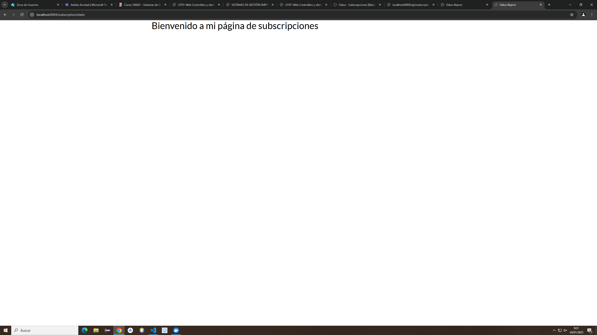
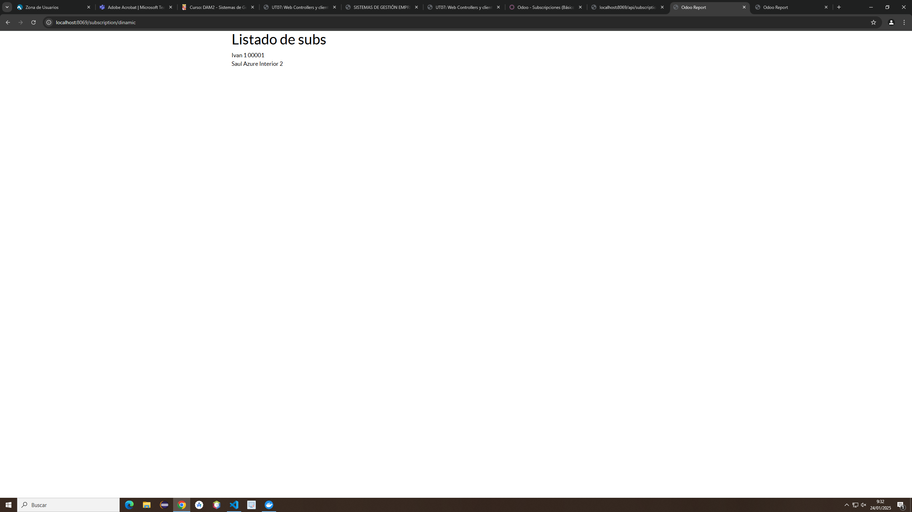

# Códigos del controllers.py
class Subscription(http.Controller):
    @http.route('/subscription/static', type='http', auth='public', website=True)
    def hello_world (self, **kwargs):
        return http.request.render('subscription.static_web', {})
    
    @http.route('/subscription/dinamic', type='http', auth='public', website=True)
    def dinamic_web(self, **kwargs):
        subs = request.env['subscription.subscription'].sudo().search([])
        return http.request.render('subscription.dinamic_web', {
            'subs': subs
        })
# Cógido de static_web
    <odoo>
        <template id="static_web" name="Página estática">
            <t t-call="web.html_container">
                

                    <h1>Bienvenido a mi página de subscripciones</h1>
                

            </t>
        </template>
    </odoo>
# Código de dinamic_web
    <odoo>
        <template id="dinamic_web">
            <t t-call="web.html_container">
                

                    <h1>Listado de subs</h1>
                    <t t-foreach = "subs" t-as="sub">
                        

                            <t t-esc="sub.name" />
                            <t t-esc="sub.customer_id.name" />
                            <t t-esc="sub.subscription_code" />
                        

                    </t>
                

            </t>
        </template>
    </odoo>
# Vista static_web

# Vista de dinamic_web
