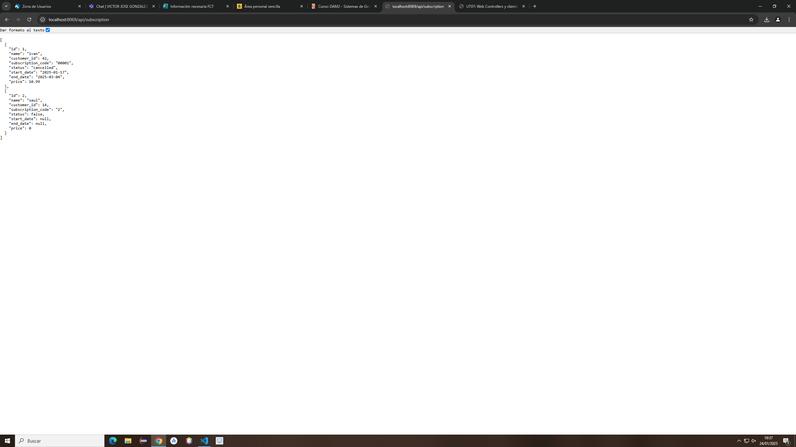

# Código del controllers
    @http.route("/api/subscription", type="http", method=['GET'], csrf=False)
    def get_subscriptions(self, **kwargs):
        try:
            status = kwargs.get('status',None)

            valid_status=['active','expired','pending','cancelled']
            if status and status not in valid_status:
                return Response(
                    json.dumps({"msg": "Valor invalido"}),
                    content_type='application/json',
                    status=400
                )
            domain = [('status', '=', status)] if status else []
            subscriptions = request.env['subscription.subscription'].sudo().search(domain)
            result=[]
            for sub in subscriptions:
                result.append({
                    'id': sub.id,
                        'name': sub.name,
                        'customer_id': sub.customer_id.id if sub.customer_id else None, #Si se quita el .id if sub.customer_id else None da error 500
                        'subscription_code': sub.subscription_code,
                        'status': sub.status,
                        'start_date': sub.start_date.isoformat() if sub.start_date else None,
                        'end_date': sub.end_date.isoformat() if sub.end_date else None,
                        'price': sub.price,
                })
            return Response(
                json.dumps(result),
                content_type='application/json',
                status=200
            )
        except Exception as e:
            return Response(
                json.dumps({"msg": "Error interno del servidor"}),
                content_type='application/json',
                status=500
            )
# Vista de GET /api/suscription
